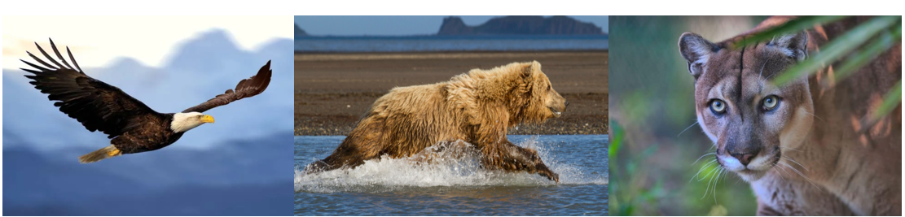
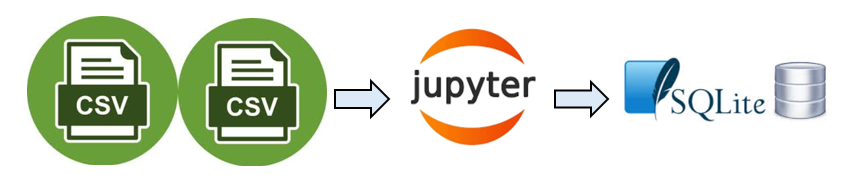
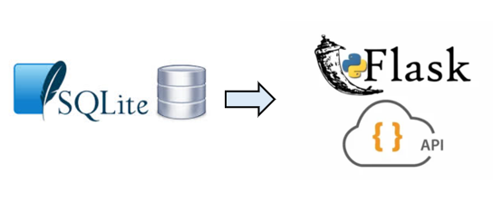
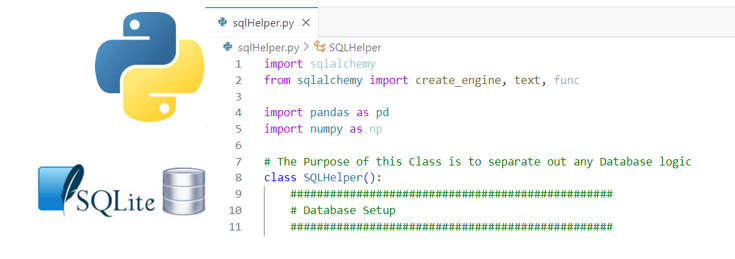
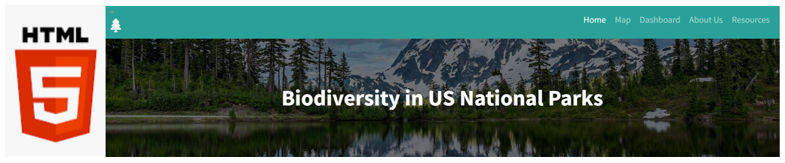

# project-3-group-01
Biodiversity in US National Parks - Endangered Species
=========
Objective
----
The objective of this project was to develop a web page designed to display endangered species within the national parks of the United States. The data utilized for the creation of this webpage was sourced from Kaggle and dates back to 2016.

Basic overview:
---
We extracted CSV files from a Kaggle dataset, which includes information on US national parks and their identified species, and converted these files into a SQL database using Jupyter Notebooks. This process involved data cleaning and transformation to ensure the accuracy and integrity of the database, which supports efficient querying and management of the information.

app.py
---
The app.py file contains the core Flask application, which interfaces with the SQLite database to retrieve and display information. This file manages the routing and application logic, ensuring that data queries are executed efficiently and that the retrieved information is presented accurately on the web interface.

SQLhelper
---
The SQLhelper file contains a set of SQL queries designed to extract the necessary data for various visualizations intended for our webpage. These queries are crafted to support the dynamic generation of visual content, ensuring that the data presented is both relevant and accurately reflects the information stored in the database.

JavaScript
---
The static folder houses JavaScript files essential for the functionality of the webpage. Specifically, app.js contains the majority of the code responsible for generating various visualizations across the site. Meanwhile, map.js is dedicated solely to the implementation of features related to the map page, handling all map-specific functionalities and interactions.

HTML
---
The templates folder encompasses all the HTML files used in the project. These files are consistent across the dashboard but include specific code tailored to their respective sections. Currently, the index, about_us, and resources pages are designed as static pages and do not contain dynamic content to be loaded. Each of these pages is structured to provide foundational content and layout as part of the overall website design.

Web App
---
The completed web application is deployed via pythonanywhere and can be viewed and interacted with at [THIS LINK](https://redrajah13.pythonanywhere.com/).